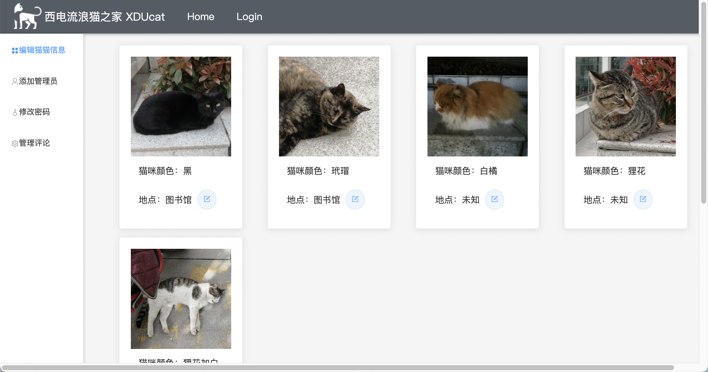
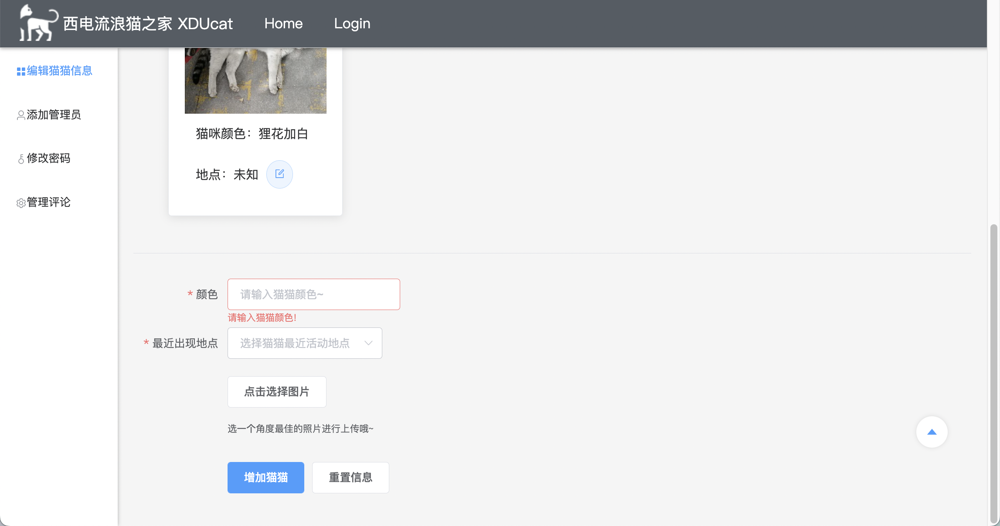
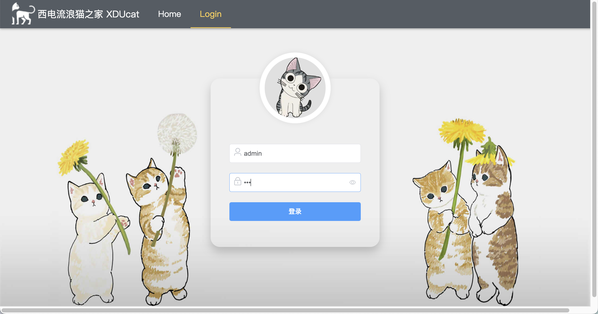
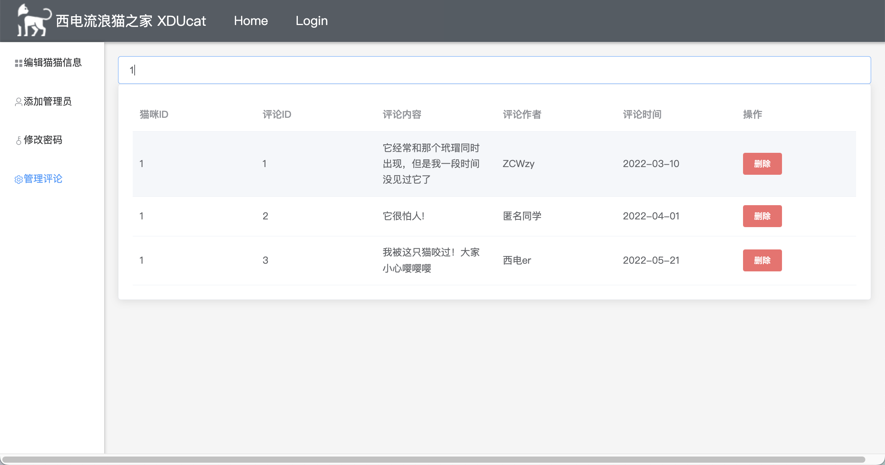

# XDUcat

项目原地址：https://gitee.com/ZCWzy/xducat

#### 背景

我电校园中有非常多可爱的猫猫。它们性格各异，出没在校园的各个角落。很多同学都爱好撸猫，然而可能因为种种原因给自己或猫咪带来伤害。
在这里我们把猫咪按照花色分类，提供猫咪基本信息。在猫咪的详细信息页开放了匿名留言功能，让大家可以自由交流猫咪的特点，补充未提供的猫咪基本信息。让大家可以大胆愉悦的逗猫撸猫交流猫猫~

#### 功能
1. 主页

   - 猫咪轮播图、猫咪推荐；

   - 猫咪活跃地点、习性、饮食爱好；

   - 导航栏、搜索栏

   

2. 猫咪详情

   - 按花色找到心仪的猫咪

   - 展示猫咪的部分照片，点击可以查看大图

   - 可以查看猫咪的具体信息

   - 可以给猫咪留言

   

   

3. 管理员界面

​		

#### 使用说明

将代码pull到本地后，打开client文件夹

首先安装依赖：`npm install`

然后即可在本地端口运行，默认8080：`npm run serve`

若要操作数据库，需同时运行后端代码，在server文件夹中。

#### 性能
1. 功能性：网页所提供的各项功能必须具备准确性和实用性，确保学生们可以得到猫咪信息。
2. 可靠性：在同学或者猫咪管理员进行非法操作时及时报错，维护数据库。
3. 高效性：让同学们有一个良好的使用体验。所见即所得。没用冗余功能和广告。便于上手，目标明确简单。